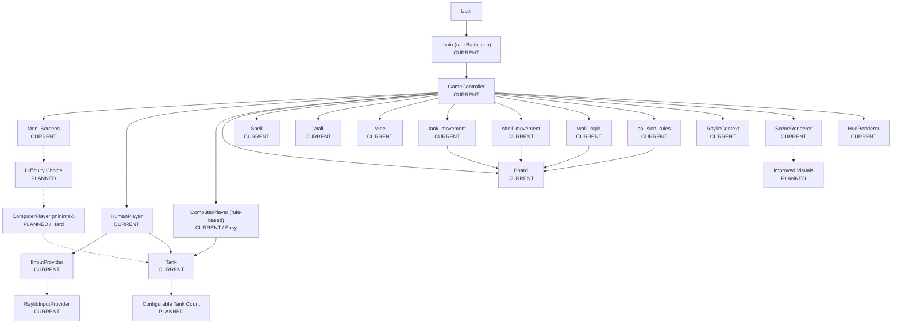

# Tank Battle

**Tank Battle** is a local two-player tank combat game written in C++ with raylib.

The goal of this project is to build a small but complete real-time game from scratch: a fixed-timestep simulation, a layered `data / logic / handlers` architecture, collision resolution, and (eventually) a real search-based AI opponent.

> Tank Battle is currently under active development.

---

## Features

### Currently available

* Local two-player battles: Human vs Human, or Human vs Computer
* Each player commands two tanks, with a key to switch the active tank
* Independent left/right track control per tank (forward, backward, or stay on each side), so movement and rotation come from the same mechanic
* Turret fire with a per-tank cooldown
* A tank's cannon can be shot off independently of destroying the tank body
* Destructible walls with two-stage damage (strong, then weak, then destroyed)
* Mines with a visibility mechanic — a mine goes invisible when a cannon or an active shell passes near it, and reappears otherwise
* Full collision system: shell vs tank body, shell vs cannon, shell vs shell, shell vs wall, mine vs tank
* Win/tie detection when all of a player's tanks are destroyed
* Pause menu (resume, or quit to the main menu)
* Main menu, opponent-selection screen, and an in-game controls/key-bindings screen
* A basic rule-based computer opponent: fires when it has a clear, friendly-fire-free line of sight, evades incoming shells, and otherwise moves semi-randomly
* Fixed-timestep game loop (simulation ticks independently of the render/input frame rate)
* 2D rendering via raylib, with a live HUD panel showing each player's remaining lives
* Per-player configurable key bindings

### Planned

* A difficulty choice at the start of a Human vs Computer game: **Easy**, using the existing rule-based computer player, and **Hard**, using a new alpha-beta pruned minimax search AI
* Improved visuals
* A choice of how many tanks each player plays with (currently fixed at two)

---

## Architecture

The diagram below shows both the **current** architecture and the features planned for the future.



**CURRENT** = already implemented

**PLANNED** = planned for a future version

---

## Project Structure

```text
tank_battle/
│
├── constants/
│   └── constants.h        ← board geometry, symbols, tuning, key bindings
│
├── data/                  ← plain game state
│   ├── point.h / .cpp
│   ├── board.h / .cpp
│   ├── tank.h / .cpp
│   ├── shell.h / .cpp
│   ├── wall.h / .cpp
│   └── mine.h / .cpp
│
├── logic/                 ← rules, platform-agnostic
│   ├── player.h / .cpp
│   ├── human_player.h / .cpp
│   ├── computer_player.h / .cpp
│   ├── input_provider.h
│   ├── tank_spawn.h / .cpp
│   ├── tank_movement.h / .cpp
│   ├── shell_movement.h / .cpp
│   ├── wall_logic.h / .cpp
│   ├── collision_rules.h / .cpp
│   └── char_utils.h
│
├── handlers/               ← raylib-facing orchestration and rendering
│   ├── game_controller.h / .cpp
│   ├── raylib_context.h / .cpp
│   ├── raylib_input_provider.h / .cpp
│   ├── scene_renderer.h / .cpp
│   ├── hud_renderer.h / .cpp
│   └── menu_screens.h / .cpp
│
├── tankBattle.cpp
├── CMakeLists.txt
└── README.md
```

---

## Game Loop & Layering

Tank Battle runs a **fixed-timestep simulation** decoupled from rendering. The game logic advances exactly once per tick regardless of frame rate, while rendering and input polling run every real frame:

```cpp
constexpr double GAME_TICK_SECONDS = 0.5;
constexpr int TARGET_FPS = 60; // render/input-poll rate; game logic still steps once per GAME_TICK_SECONDS
```

```cpp
input.pollFrame();
accumulatedTime += GetFrameTime();
while (accumulatedTime >= GAME_TICK_SECONDS) {
    accumulatedTime -= GAME_TICK_SECONDS;
    if (runOneTick()) return;
}
renderFrame();
```

The `logic/` layer has no dependency on raylib at all: `HumanPlayer` reads input through the `IInputProvider` interface, and only the `handlers/` layer's `RaylibInputProvider` knows about raylib's actual key-polling API. The same separation lets `ComputerPlayer` — and, in the future, a minimax-based `ComputerPlayer` variant — plug into `GameController` without either the game loop or the rendering code needing to change.

---

## Installation

Requirements: CMake 3.27+, and a C++20-capable compiler. `raylib` and `raylib-cpp` are fetched automatically via CMake's `FetchContent` if not already installed.

Clone the repository:

```bash
git clone https://github.com/TalGershanov/tank_battle.git
cd tank_battle
```

Configure and build:

```bash
cmake -B build
cmake --build build
```

---

## Usage

Run the built executable (`tankBattle`, located in the build directory):

```bash
./build/tankBattle
```

### Main menu

```text
(1) Start a new game
(8) Show controls
(9) EXIT
```

### Opponent selection

```text
(1) Human vs Human
(2) Human vs Computer
```

### Controls

| Action              | Player 1 | Player 2 |
|---------------------|----------|----------|
| Left track forward   | Q        | U        |
| Left track backward  | A        | J        |
| Right track forward  | E        | O        |
| Right track backward | D        | L        |
| Stay                 | S        | K        |
| Fire                 | W        | I        |
| Switch active tank   | Z        | M        |

While in a match, press `ESC` to pause (press again to resume, or `X` to quit to the main menu).

---

## Roadmap

### Phase 1 — Core Prototype

* [x] Board, tank, shell, wall, and mine data model
* [x] Tank movement via independent track control
* [x] Shooting, cooldowns, and cannon-loss mechanic
* [x] Destructible walls
* [x] Mines with a visibility mechanic
* [x] Full collision resolution
* [x] Human vs Human and Human vs Computer modes
* [x] Main menu, opponent selection, and controls screen
* [x] Win/tie detection and pause menu

### Phase 2 — Raylib Port & Layered Refactor

* [x] Split into `data / logic / handlers` layers
* [x] Port rendering to raylib
* [x] Platform-agnostic input abstraction (`IInputProvider`)
* [x] Fixed-timestep game loop decoupled from rendering

### Phase 3 — Difficulty & AI

* [ ] Difficulty selection screen (Easy / Hard)
* [ ] Alpha-beta pruned minimax AI for Hard difficulty

### Phase 4 — Polish

* [ ] Improved visuals
* [ ] Configurable number of tanks per player

---

## Status

Tank Battle is an actively developed project. The core gameplay loop — movement, shooting, walls, mines, collisions, menus, and a basic AI opponent — is complete and playable. The next major milestone is a proper search-based AI as a "Hard" difficulty option.

---

## Author

**Tal Gershanov**

GitHub: https://github.com/TalGershanov/tank_battle
